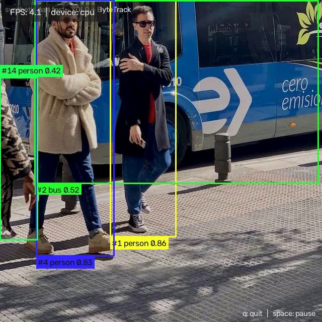
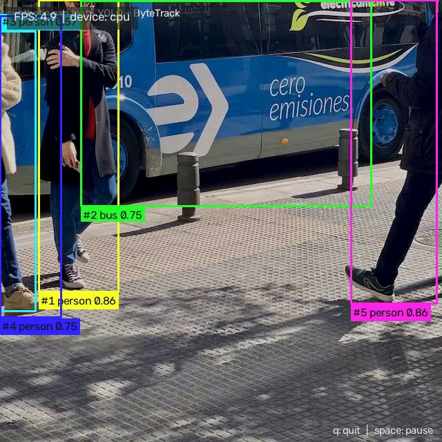
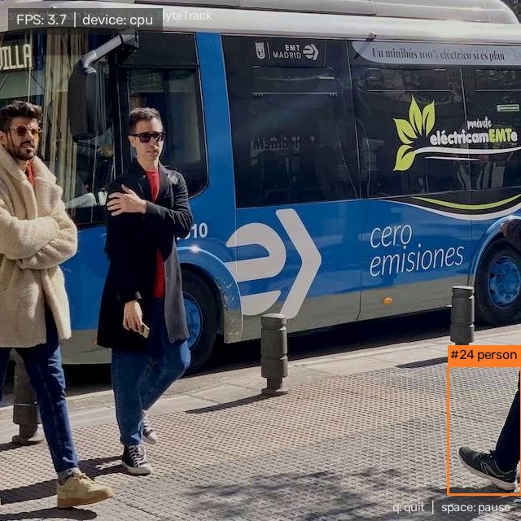

# Object Detection & Tracking

A real-time computer-vision system that detects objects in webcam or video
input and tracks them across frames with unique, persistent tracking IDs.

Built with **Ultralytics YOLO** for detection and a self-contained
**ByteTrack** implementation for multi-object tracking, driven by OpenCV.


---

## Project Overview

The system processes each frame through two stages:

1. **Detection** — a pre-trained YOLO model finds all objects in the frame and
   returns their bounding boxes, class names and confidence scores.
2. **Tracking** — ByteTrack matches the current detections against the tracks
   from previous frames. Each physical object keeps the same numeric **ID**
   while it stays in view, even through brief occlusions or confidence drops.

The annotated frames are shown live (with FPS) and/or written to a video file.

Example processed frame (saved from the bundled sample run):

<p align="center">
  
</p>

*Note: images inside `output/sample_frames/` are generated by running the
project on a synthetic test clip (see “Testing offline”).*

---

## Project Structure

```
codealpha-object-detection-and-tracking/
├── src/                        # Core application code
│   ├── main.py                 # CLI entry point & argument parsing
│   ├── pipeline.py             # capture → detect → track → display/save loop
│   ├── utils.py                # source parsing, model download, writer setup
│   ├── visualization.py        # bounding boxes, labels, FPS overlay
│   ├── detection/              # pluggable detector backends
│   │   ├── base.py             # Detection dataclass + Detector interface
│   │   └── yolo_detector.py    # Ultralytics YOLO backend
│   └── tracking/               # pluggable tracker backends
│       ├── base.py             # TrackState, TrackedObject, Tracker interface
│       ├── assignment.py       # Hungarian solver + IoU helpers (pure NumPy)
│       └── bytetrack.py        # ByteTrack + SORT-style Kalman filter
├── main.py                     # root convenience entry point (forwards to src.main)
├── scripts/                    # helper utilities
│   ├── download_models.py      # fetch pre-trained YOLO checkpoints
│   ├── make_test_video.py      # build a synthetic pan test clip
│   └── verify_workflow.py      # offline detect + track smoke test
├── models/                     # pre-trained weights (downloaded on demand)
├── input/                      # source videos + generated test clip
├── output/                     # saved annotated videos / logs / sample frames
├── requirements.txt            # Python dependencies
├── .gitignore                  # files excluded from version control
├── LICENSE                     # MIT license
├── CODE_OF_CONDUCT.md          # community standards
├── CONTRIBUTING.md             # how to contribute
├── SECURITY.md                 # vulnerability reporting
└── README.md                   # project documentation
```

---

## How Object Detection Works

- **Model.** An Ultralytics YOLOv8n (nano) model pre-trained on the COCO 80-class
  dataset is used. It is downloaded on demand, never trained in this project.
- **Inference.** Each frame is resized to `640×640`, passed through the network,
  and NMS keeps the best non-overlapping boxes.
- **Confidence split.** The detector is deliberately run at a *low* confidence
  floor (`--low-conf 0.1`). Detections below the main `--conf` threshold
  (default `0.25`) are kept only as candidates for the tracker’s second
  association stage — the ByteTrack “low-score” trick — while the high-score
  detections drive normal tracking and are drawn on screen.
- **Flexibility:** `src/detection/` defines a `Detector` interface, so other
  backends (ONNX Runtime, TensorRT, YOLO11, ...) can be added without touching
  the tracker or pipeline. `--classes` restricts YOLO to specific COCO IDs.

## How Tracking Works

`src/tracking/bytetrack.py` is a self-contained implementation of the
**ByteTrack** algorithm (Zhang et al., ECCV 2022):

1. **Kalman prediction.** Every candidate track runs a SORT-style linear
   constant-velocity Kalman filter
   (`state = [cx, cy, aspect_ratio, height, vx, vy, va, vh]`) one step forward,
   producing its predicted box for the current frame.
2. **Stage 1 — high-score association.** Detections with `score ≥ track_thresh`
   are matched to tracked + recently-lost tracks with a Hungarian assignment
   minimising `1 − IoU` (max accepted distance `iou_thresh`). Matched tracks
   are corrected with the new measurement.
3. **Stage 2 — low-score rescue.** The leftover tracks are matched against the
   remaining *low*-confidence detections with a looser IoU threshold. This is
   what usually saves a track when an object is briefly occluded or the model
   drops its confidence.
4. **Spawning & expiry.** Unmatched high-score detections create new tracks
   (each gets an incrementing ID). Tracks are marked *lost* when unmatched and
   removed after `--max-time-lost` frames without any association.

Both the detector and tracker are modular, so ByteTrack can be swapped for
SORT / Deep SORT / OC-SORT by implementing the small `Tracker` interface.

---

## Installation

Requires **Python 3.10 – 3.13** (PyTorch does not yet support 3.14 reliably).

```bash
# 1. Create a virtual environment
python -m venv .venv

# 2. Activate it
# Windows (PowerShell):
.venv\Scripts\Activate.ps1
# Linux / macOS:
source .venv/bin/activate

# 3. Install dependencies
pip install -r requirements.txt

# 4. (Optional) download a model explicitly
python scripts/download_models.py            # -> models/yolov8n.pt
python scripts/download_models.py -m yolov8s.pt
```

> If the model is missing, `main.py` downloads `yolov8n.pt` automatically the
> first time it is needed.

### GPU acceleration (optional)

The default `pip` install uses the CPU build of PyTorch. The code uses CUDA
automatically when a GPU is visible (`--device auto` default). To enable GPU:

```bash
# Windows (CUDA 12.x)
pip install torch torchvision --index-url https://download.pytorch.org/whl/cu128
```

---

## Model Information

| Model      | Size   | mAP50-95 (COCO) | Notes                       |
|------------|--------|-----------------|-----------------------------|
| `yolov8n`  | ~6 MB  | 37.3            | fastest, ideal for CPU      |
| `yolov8s`  | ~23 MB | 44.9            | good speed/accuracy balance |
| `yolov8m`  | ~50 MB | 50.2            | higher accuracy             |
| `yolo11n`  | ~5 MB  | 39.5            | newest nano model           |

Use `--weights models/yolov8n.pt` (default) or any other `.pt`/`.onnx`/`.engine`
file. All pre-trained on COCO (80 classes: person, car, truck, dog, ...).

---

## Usage

> Each command can be launched as `python src/main.py ...` or
> `python -m src.main ...`.

### Webcam usage

```bash
python src/main.py --source webcam            # default webcam (index 0)
python src/main.py --source 1                 # second webcam
python src/main.py --source webcam --conf 0.3 --weights models/yolov8s.pt
```

### Video-file usage

```bash
python src/main.py --source input/video.mp4
```

### Saving the processed video

```bash
python src/main.py --source input/video.mp4 --output output/tracked.mp4
python src/main.py --source webcam --output output/live_recording.mp4 --fourcc avc1
```

Use `--save-txt` alongside `--output` to also write a CSV-like track log
(`output/tracked_tracks.txt`) with one row per object per frame:

```
frame, track_id, class, confidence, x1, y1, x2, y2
```

### Headless / batch mode

```bash
python src/main.py --source video.mp4 --output out.mp4 --no-display
```

No window opens; FPS and a session summary still print to the console.

### Configuration reference

| Option            | Default     | Description                                    |
|-------------------|-------------|------------------------------------------------|
| `--source`        | `webcam`    | Webcam index, `webcam`, or a video path        |
| `--weights`       | `models/yolov8n.pt` | Pre-trained detector weights         |
| `--conf`          | `0.25`      | Confidence threshold (track + display gate)    |
| `--low-conf`      | `0.10`      | Detector emission floor (stage-2 candidates)   |
| `--imgsz`         | `640`       | Inference resolution                           |
| `--iou`           | `0.6`       | NMS IoU threshold                              |
| `--device`        | `auto`      | `auto` (GPU if present), `cpu`, `0`, `cuda:0`  |
| `--classes`       | all         | Restrict to COCO class ids, e.g. `--classes 0` |
| `--tracker`       | `bytetrack` | `bytetrack` or `none` (detection only)         |
| `--iou-track`     | `0.2`       | ByteTrack stage-1 IoU threshold                |
| `--max-time-lost` | `30`        | Frames a track may stay lost before expiry     |
| `--show-lost`     | off         | Keep drawing occluded tracks                   |
| `--output`        | none        | Save annotated video to this path              |
| `--fourcc`        | `mp4v`      | Video codec for `--output` (`mp4v`, `avc1`, ...) |
| `--no-display`    | off         | Run without a window                           |
| `--save-txt`      | off         | Write a per-frame tracking log                 |
| `--window-scale`  | `0.9`       | Display window scale                           |

### Key bindings

| Key    | Action            |
|--------|-------------------|
| `q` / `ESC` | Quit            |
| `space`      | Pause/resume   |

The top-left badge shows the live FPS plus the active compute device.

---

## Output Examples

Sample annotated frames from the bundled synthetic test clip:

| Frame 50 | Frame 200 | Frame 380 |
|----------|-----------|-----------|
|  |  |  |

Each object is drawn with a color derived from its **track ID**, plus a label
`#<id> <class> <conf>`. A processed mp4 (`output/sample_tracked.mp4`) is also
produced when you run the pipeline on the test clip.

### Verifying the workflow offline (no camera needed)

```bash
# 1. Build a synthetic test clip that pans over a real photo (bus.jpg) so real
#    objects are visible and move on screen.
python scripts/make_test_video.py            # -> input/sample_tracking.mp4

# 2. Run a quick detection + tracking smoke test on it.
python scripts/verify_workflow.py --frames 80

# 3. Or run the full pipeline and save the annotated video.
python src/main.py --source input/sample_tracking.mp4 --output output/sample_tracked.mp4
```

Typical `verify_workflow.py` output on a CPU-only machine:

```
device          : cpu
frames analysed : 80
avg detections  : 6.2 / frame
avg tracks      : 4.8 / frame
unique track IDs: 7
longest-lived ID: #3 over 78 frames
result          : OK
```

---

## Technologies Used

- **Python 3.10+**
- **Ultralytics YOLOv8/YOLO11** — pre-trained object detection
- **PyTorch** — inference backend (CPU + CUDA)
- **OpenCV** — video capture, frame I/O, overlay drawing
- **NumPy** — assignment matrices and Kalman math
- **ByteTrack** — multi-object tracking (implemented in-repo, EC2 2022)

## Error Handling

| Failure                       | Behaviour                                                     |
|-------------------------------|---------------------------------------------------------------|
| Missing video file            | CLI error before anything runs                                |
| Invalid webcam index / no cam | Clean message, suggests checking index + format, exit 2       |
| Unsupported / corrupt video   | “Could not open source …” message                             |
| Model load failure            | Suggests `scripts/download_models.py` or a valid `--weights`  |
| Missing dependencies          | Prints exact `pip install …` command, exits                   |
| Unsupported output codec      | Falls back to `mp4v` / `XVID` / `MJPG`, else clear error      |

## Limitations

- **No re-identification.** A track that leaves the frame and returns gets a new
  ID — the system does not remember appearance (that needs an appearance
  embedding model such as DeepSORT/BoT-SORT).
- **Constant-velocity Kalman model.** Fast, erratic motion with heavy
  occlusion can cause temporary ID loss (recovered only while a track is still
  alive; the target is one algorithm, not a re-ID system).
- **COCO classes only.** Detection is limited to the 80 pre-trained classes.
- **Tracking quality reflects detector quality.** Small/distant objects or
  motion blur produce unstable detections and shorter tracks.
- **CPU-only installs are slow** (`yolov8n` runs at a few FPS at 640px). GPU or
  a smaller `--imgsz` helps a lot.
- **Measuring “accuracy”.** No MOTA/IDF1 numbers are reported here by default;
  a ground-truth MOT-style evaluation would be needed for those.

## Possible Improvements

- Add appearance embeddings (DeepSORT / BoT-SORT / OSNet) for re-identification.
- Swap in larger or newer detectors (YOLO11, YOLOv9/E, RT-DETR) behind the same
  `Detector` interface; export to ONNX/TensorRT for speed.
- Add a trajectory drawing mode (draw the tail of each track).
- Region-of-interest rules: count objects crossing a line, or trigger on
  boundary entry/exit.
- CLI profile support (`--profile high-accuracy`, `--profile realtime`).
- Automatic MOT evaluation (MOT17-style) with HOTA/MOTA/IDF1 metrics.
- Multi-camera / multi-threaded capture with frame batching on GPU.

---

## License

MIT — see [LICENSE](LICENSE).